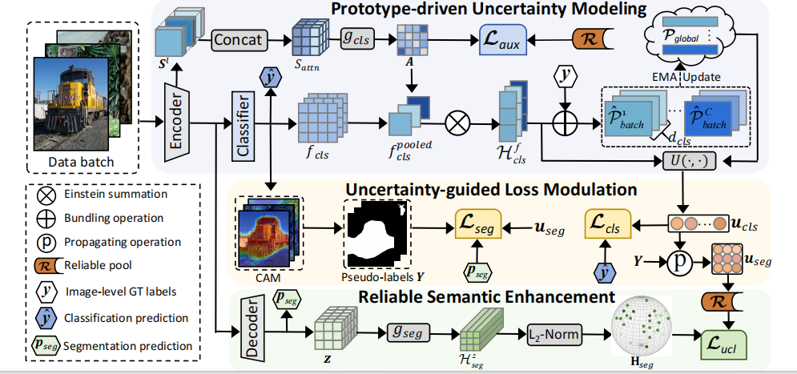

# Escaping the CAM Shadow: Uncertainty-Guided Reliable Learning for Weakly Supervised Semantic Segmentation



## Abstract

> Weakly supervised semantic segmentation (WSSS) suffers from an inherent mismatch between coarse image-level annotations and dense pixel-level predictions. To bridge this gap, existing methods primarily focus on generating refined class activation maps (CAM) as pseudo-labels. However, we argue that this focus is insufficient as it overlooks a critical component: the segmentation decoder. The decoder is typically trained through superficial alignment of predictions with pseudo-labels in the logit space. Given the noisy nature of such labels, this naive supervision leads to error accumulation and limits performance. To address this, we propose an Uncertainty-Guided Reliable Learning (UGRL) framework that exerts dual control to reshape the learning process, achieving robust supervision that escapes the CAM shadow. The foundation of UGRL is a prototype-driven uncertainty modeling module that estimates the reliability of class-wise supervision. This uncertainty then enables two synergistic control mechanisms. First, it adaptively modulates classification and segmentation losses, encouraging the model to learn from more trustworthy signals. Second, it guides the structuring of the decoder’s feature space. Rather than relying solely on superficial alignment, UGRL enforces deeper representation alignment by applying contrastive learning on low-uncertainty pixels.
> 

## Getting Started

This section provides instructions for setting up the environment and preparing the dataset.

### 1. Dataset Preparation

### PASCAL VOC 2012

First, download the PASCAL VOC 2012 dataset.

```bash
# Download the dataset
wget <http://host.robots.ox.ac.uk/pascal/VOC/voc2012/VOCtrainval_11-May-2012.tar>

# Extract the archive
tar -xvf VOCtrainval_11-May-2012.tar

```

### Augmented Annotations

We use augmented annotations from the [SBD dataset](http://home.bharathh.info/pubs/codes/SBD/download.html) to improve performance.

1. Download the augmented annotations from [Dropbox](https://www.dropbox.com/s/oeu149j8qtbs1x0/SegmentationClassAug.zip?dl=0).
2. Unzip `SegmentationClassAug.zip`.
3. Move the resulting `SegmentationClassAug` folder into `VOCdevkit/VOC2012/`.

After these steps, the directory structure should look like this:

```
VOCdevkit/
└── VOC2012
    ├── Annotations
    ├── ImageSets
    ├── JPEGImages
    ├── SegmentationClass
    ├── SegmentationClassAug  # <-- Augmented masks
    └── SegmentationObject

```

### 2. Environment Setup

We recommend using Conda to manage the environment.

```bash
# Create and activate a new conda environment
conda create --name runner3.7 python=3.7
conda activate runner3.7

# Install the required packages
pip install -r requirements.txt

```

### 3. Pre-trained Weights

Download the ImageNet-1k pre-trained weights from the official [SegFormer](https://github.com/NVlabs/SegFormer#training) repository and place them in the `pretrained/` directory.

## Training

To start training on the PASCAL VOC dataset, run the provided script:

```bash
# Train on VOC
bash launch/run_sbatch_voc.sh

```

## Acknowledgement

- The implementation of our feature aggregation module is based on and adapted from the code in [afa](https://github.com/rulixiang/afa).

Many thanks for their brilliant work!
